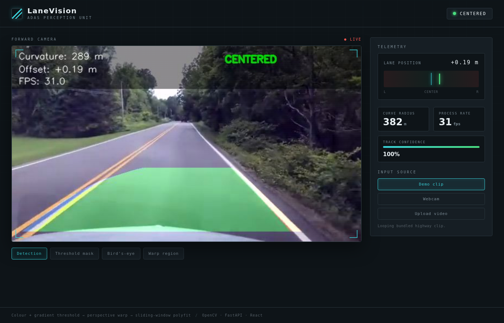
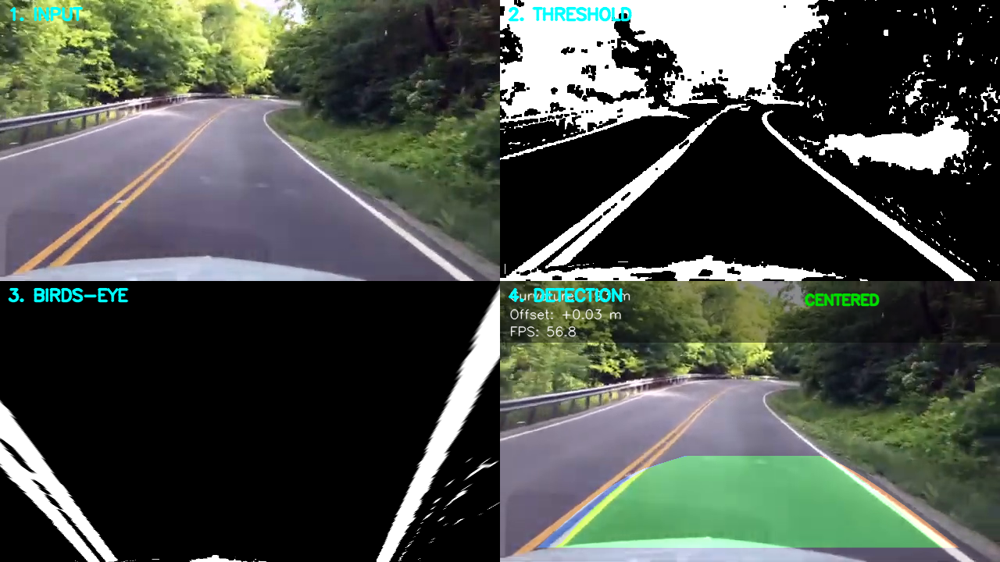

<div align="center">

# 🛣️ LaneVision

### Real-time lane detection that follows curves — with a live telemetry dashboard

Colour + gradient thresholding → bird's-eye perspective warp → sliding-window
polynomial fit. Fast, interpretable classical computer vision, wrapped in a
React dashboard styled like an automotive instrument cluster.

[](https://github.com/rishii-hub/realtime-lane-detection/actions/workflows/ci.yml)
[](LICENSE)


</div>



---

## Overview

Most beginner lane detectors use Canny edge detection plus a Hough transform,
which can only fit **straight lines** and treats every strong edge — shadows,
cracks, other cars — as a lane candidate. LaneVision takes the more robust
"advanced lane finding" approach: it isolates lane pixels by **colour**, warps
the road to a **bird's-eye view**, and fits a **polynomial** to each lane so it
tracks curves. It then reports real-world **curvature** and **vehicle offset**,
and raises a **lane-departure** flag — the same signals a production lane-keep
system exposes.

## Features

- **Follows curves**, not just straight lines — 2nd-degree polynomial fit per lane
- **Robust pixel selection** — HLS lightness (white) + LAB b-channel (yellow) +
  Sobel gradient, so shadows and tar seams don't fool it
- **Real metrics** — radius of curvature (m), vehicle offset (m), lane-departure status
- **Live dashboard** — MJPEG feed, telemetry panel, lane-position gauge, view-mode
  toggles, and drag-to-upload video
- **Four view modes** — final detection, threshold mask, bird's-eye warp, warp region
- **Runs anywhere frames come from** — bundled demo clip, webcam, or an uploaded file
- **Actually tested** — 22 pytest cases including a real-video detection-rate check,
  plus CI running ruff / black / eslint / tsc / build

## Pipeline



```
frame
  → colour + gradient threshold      (HLS L, LAB b, Sobel-x → binary mask)
  → perspective warp                 (road plane → bird's-eye)
  → sliding-window / prior search    (collect lane pixels per vertical window)
  → 2nd-degree polynomial fit        (x = a·y² + b·y + c  per lane)
  → sanity check + temporal smoothing
  → unwarp lane polygon onto frame + curvature / offset / status / FPS
```

A full walkthrough of each stage — with the reasoning behind it — is in
[`docs/PIPELINE.md`](docs/PIPELINE.md). The system design is in
[`docs/ARCHITECTURE.md`](docs/ARCHITECTURE.md).

## Tech stack

| Layer      | Tools                                                        |
| ---------- | ----------------------------------------------------------- |
| Vision     | Python · OpenCV · NumPy                                      |
| Backend    | FastAPI · Uvicorn (MJPEG streaming + JSON telemetry)        |
| Frontend   | React 18 · TypeScript (strict) · Vite · CSS Modules         |
| Quality    | pytest · ruff · black · eslint · GitHub Actions             |

## Quick start

```bash
git clone https://github.com/rishii-hub/realtime-lane-detection.git
cd realtime-lane-detection

# 1. Python dependencies
pip install -r requirements.txt

# 2. Build the dashboard (one time)
cd frontend && npm install && npm run build && cd ..

# 3. Run
python app.py            # → open http://localhost:8000
```

Prefer a desktop window or a headless benchmark instead of the web UI?

```bash
python cli.py                        # OpenCV window on the demo clip
python cli.py --source 0             # webcam
python cli.py --source path/to.mp4   # any video file
python cli.py --source demo --benchmark   # print detection rate + fps, no window
```

If you have `make`, every common task is wrapped:

```bash
make build   # build the frontend
make run     # start the dashboard
make test    # run pytest
make lint    # ruff + eslint
make bench   # headless benchmark
```

## Usage

In the dashboard:

- **Input source** — switch between the bundled demo clip, your webcam, or an
  uploaded video.
- **View mode** — flip between the final detection overlay and the intermediate
  stages (threshold mask, bird's-eye warp, warp region) to see how it works.
- **Telemetry** — curvature, process rate, track confidence, and a live
  lane-position gauge update several times a second.

## Configuration

The pipeline is intentionally configurable in code rather than hidden behind
magic numbers:

| What                        | Where                              |
| --------------------------- | ---------------------------------- |
| Bird's-eye trapezoid points | `lane_detector/perspective.py`     |
| Metres-per-pixel scaling    | `lane_detector/lane_fit.py`        |
| Colour / gradient thresholds| `lane_detector/thresholding.py`    |
| Smoothing window, departure threshold | `lane_detector/detector.py` |

The perspective region and scaling are tuned for a forward-facing dashcam with
the horizon near the vertical middle of the frame; a different camera mounting
needs those re-tuned.

## Performance

Measured on the bundled 1,734-frame highway clip (640×360) on CPU:

| Metric                    | Value       |
| ------------------------- | ----------- |
| End-to-end processing     | ~52 fps avg |
| Frames with a valid lock  | 100%        |
| Curvature on straights    | very large radius (near-straight) |
| Curvature through curves  | a few hundred metres |

> Numbers are from `python cli.py --source demo --benchmark` on the included
> clip; they'll vary with your CPU and footage. Run it yourself to reproduce.

## Project structure

```
realtime-lane-detection/
├── lane_detector/          # pure CV package (no web/GUI deps)
│   ├── thresholding.py     #   colour + gradient masks
│   ├── perspective.py      #   bird's-eye warp / unwarp
│   ├── lane_fit.py         #   sliding-window search, polyfit, curvature
│   └── detector.py         #   orchestration, smoothing, rendering, HUD
├── app.py                  # FastAPI server (MJPEG stream + telemetry)
├── cli.py                  # desktop / headless runner
├── frontend/               # React + TypeScript dashboard (Vite)
│   └── src/{components,hooks,api.ts,types.ts,App.tsx}
├── tests/                  # pytest suite (unit + real-video integration)
├── docs/                   # architecture + pipeline write-ups and diagrams
├── legacy/                 # original v1 straight-line detector (reference)
└── test3.mp4               # bundled demo clip
```

## Testing

```bash
pytest                 # 22 tests: thresholding, perspective, fit, integration
```

The suite includes an integration test that runs the real demo clip through the
pipeline and asserts a high lane-lock rate, so regressions in detection quality
fail CI — not just crashes.

## Roadmap

- [ ] Port the pipeline to TypeScript/WebGL for a zero-backend GitHub Pages demo
- [ ] Adaptive perspective calibration instead of a fixed trapezoid
- [ ] Vehicle / obstacle detection overlay
- [ ] Configurable thresholds from the dashboard UI
- [ ] Export an annotated video file from an uploaded clip

## Contributing

Contributions are welcome — see [CONTRIBUTING.md](CONTRIBUTING.md). Run
`make test && make lint` before opening a PR; CI runs the same checks.

## License

[MIT](LICENSE) — free to use, modify, and learn from.

## Author

Built by **Rishi** ([@rishii-hub](https://github.com/rishii-hub)) as a computer
vision portfolio project.
