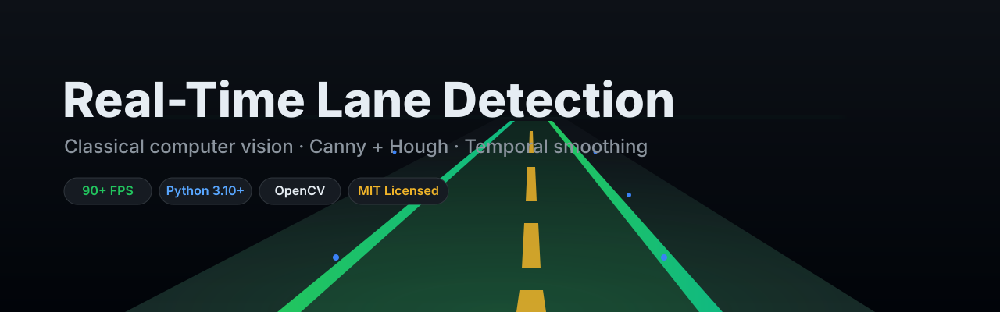
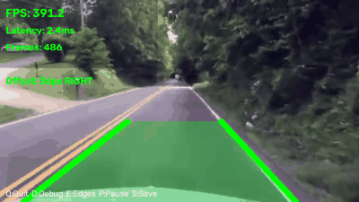
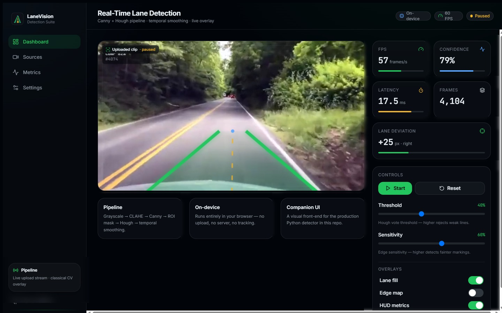
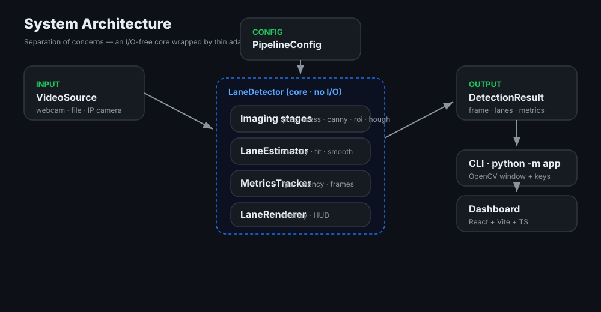
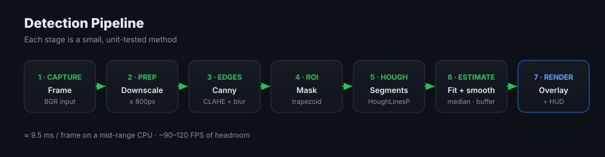
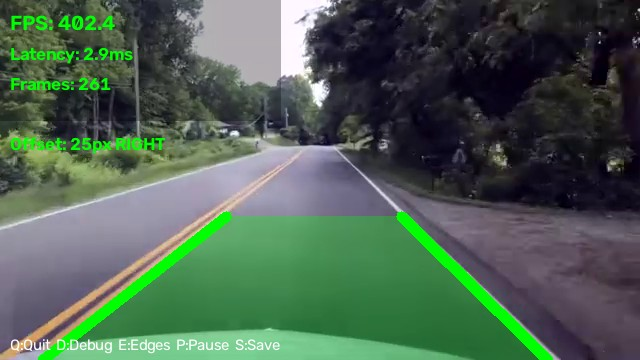
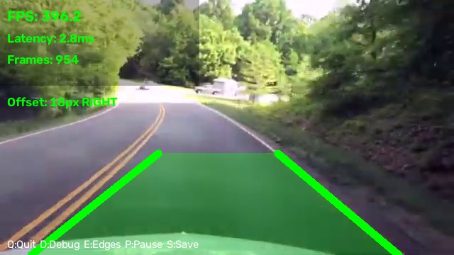
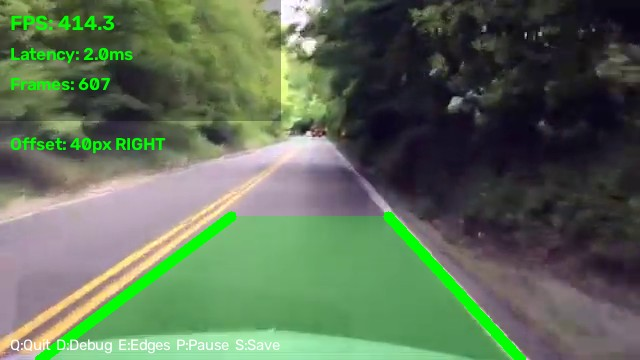
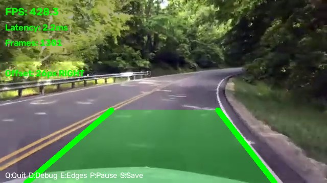

<div align="center">
  

  <h1>Real-Time Lane Detection</h1>

  <p><strong>A fast, interpretable lane-detection pipeline built on classical computer vision — plus a modern dashboard to drive it.</strong></p>

  <p>
    <a href="https://rishii-hub.github.io/realtime-lane-detection/"></a>
    <a href="#-quick-start"></a>
    <a href="docs/"></a>
  </p>

  <p>
    <a href="https://github.com/rishii-hub/realtime-lane-detection/actions/workflows/tests.yml"></a>
    <a href="https://github.com/rishii-hub/realtime-lane-detection/actions/workflows/lint.yml"></a>
    <a href="https://github.com/rishii-hub/realtime-lane-detection/actions/workflows/deploy-pages.yml"></a>
  </p>

  <p>
    
    
    
    
    
    
  </p>
</div>

---

## 📖 Overview

**Real-Time Lane Detection** turns a live camera or video stream into an annotated
lane overlay — the same idea behind the lane-keeping assist in modern cars. It
uses **classical computer vision** (Canny edge detection + Hough transform +
temporal smoothing), so it runs in real time on a plain CPU with zero training
data and fully interpretable behaviour.

The repository ships two things:

1. 🐍 **A production-style Python package** (`app/`) — a clean, tested,
   configuration-driven detection pipeline.
2. ⚛️ **A modern React dashboard** (`frontend/`) — a dark, minimal UI to run the
   detector on an uploaded clip or your webcam, with live metrics and controls.

<div align="center">
  
  <br/>
  <sub>Real output from the pipeline running on the bundled sample clip.</sub>
</div>

## ✨ Features

- 🛣️ **Robust lane detection** — Canny + probabilistic Hough with slope filtering
- 🎯 **Temporal smoothing** — rolling history eliminates flicker and bridges dropouts
- 🧭 **Lane-departure metric** — signed pixel offset from lane centre with warnings
- ⚡ **Real-time performance** — ~90+ FPS of compute headroom on a mid-range CPU
- 🎛️ **Fully configurable** — every parameter is a typed, validated dataclass (or YAML)
- 🧱 **Clean architecture** — an I/O-free core, separated concerns, 90%+ test coverage
- 🖥️ **Multi-source input** — webcam, video files, or IP-camera streams
- 🎨 **Modern dashboard** — drag-and-drop upload, live metrics, motion, dark mode
- 🧪 **Batteries included** — CI, pre-commit, docs, examples, community health files

## 🚀 Quick Start

### Python pipeline

```bash
# Clone
git clone https://github.com/rishii-hub/realtime-lane-detection.git
cd realtime-lane-detection

# Install (Python 3.10+)
pip install -r requirements.txt        # or: pip install -e ".[dev]"

# Run on the bundled sample clip
python -m app --source samples/highway_drive.mp4

# ...or your webcam
python -m app --source 0
```

> **Controls:** `Q` quit · `P` pause/resume · `E` toggle edge view · `S` save frame

### Dashboard

> **No install needed** — try the hosted dashboard at
> **[rishii-hub.github.io/realtime-lane-detection](https://rishii-hub.github.io/realtime-lane-detection/)**
> and click *"Try a sample clip"*.

```bash
cd frontend
npm install
npm run dev        # → http://localhost:5173
```

<div align="center">
  
  <br/>
  <sub>The dashboard processing the bundled sample clip — live overlay, metrics, and controls.</sub>
</div>

## 🏗️ Architecture

The core is deliberately **I/O-free**: `LaneDetector.process(frame)` takes an
image and returns a `DetectionResult`. All camera/window/file handling lives in
thin adapters around it, so the pipeline is trivially testable and embeddable.

<div align="center">
  
</div>

## 🔬 Pipeline

<div align="center">
  
</div>

| Stage | What happens |
| ----- | ------------ |
| **1. Capture** | Read a BGR frame from webcam / file / IP camera |
| **2. Pre-process** | Downscale wide frames for speed |
| **3. Edges** | Grayscale → Gaussian blur → CLAHE → Canny |
| **4. ROI** | Mask a trapezoidal region ahead of the vehicle |
| **5. Hough** | Probabilistic Hough transform → line segments |
| **6. Estimate** | Slope filter → classify L/R → median fit → temporal smoothing |
| **7. Render** | Lane fill, boundaries, deviation, and HUD |

> 📚 Deep dive: [How Detection Works](docs/HowDetectionWorks.md) ·
> [Pipeline](docs/Pipeline.md) · [Architecture](docs/Architecture.md)

## 🧰 Tech Stack

| Layer | Technologies |
| ----- | ------------ |
| **Detection** | Python 3.10+ · OpenCV · NumPy |
| **Config** | dataclasses · PyYAML |
| **Dashboard** | React 18 · Vite · TypeScript · Tailwind CSS · Framer Motion |
| **Quality** | pytest · ruff · black · mypy · pre-commit |
| **CI/CD** | GitHub Actions (lint · types · tests · build) |

## 📸 Screenshots

Output of the Python pipeline (`python -m app`) on the bundled sample clip:

<div align="center">
  
  
  <br/>
  
  
</div>

## ⚙️ Configuration

Every tunable parameter is a validated dataclass and can be overridden with YAML:

```bash
python -m app --source samples/highway_drive.mp4 --config configs/default.yaml
```

```yaml
detection:
  canny_low: 50
  canny_high: 150
  roi_horizon: 0.60
  hough_threshold: 40
  smoothing_window: 5
```

Full reference: [docs/Configuration.md](docs/Configuration.md).

## 🧪 Usage as a library

```python
import cv2
from app import LaneDetector, PipelineConfig

detector = LaneDetector(PipelineConfig())
frame = cv2.imread("frame.jpg")

result = detector.process(frame)
print(result.metrics.fps, result.lanes.deviation_px(frame.shape[1]))
cv2.imwrite("annotated.png", result.annotated)
```

More runnable examples in [`examples/`](examples/).

## 📊 Performance

Measured on a mid-range laptop CPU (640×480 input):

| Stage | Time | Share |
| ----- | ---- | ----- |
| Edge detection | ~3.1 ms | 33% |
| Hough transform | ~4.2 ms | 45% |
| Everything else | ~2.2 ms | 22% |
| **Total** | **~9.5 ms** | **100%** |

That's **~90–120 FPS** of headroom on the algorithm itself. See
[docs/Performance.md](docs/Performance.md) for the breakdown and tuning guide.

## 📁 Project Structure

```
realtime-lane-detection/
├── app/                      # 🐍 Python detection package
│   ├── config.py             #    Typed, validated configuration
│   ├── camera.py             #    Context-managed video source
│   ├── detector.py           #    Pipeline orchestrator (I/O-free)
│   ├── lane.py               #    Geometry: classify · fit · smooth
│   ├── visualization.py      #    Overlay + HUD rendering
│   ├── metrics.py            #    FPS / latency tracking
│   ├── runner.py             #    Interactive OpenCV window
│   └── __main__.py           #    CLI entry point
├── frontend/                 # ⚛️ React + Vite + TS dashboard
├── docs/                     # 📚 Architecture, pipeline, performance
├── examples/                 # ▶️ Runnable usage examples
├── tests/                    # 🧪 pytest suite
├── configs/                  # ⚙️ YAML configuration presets
├── assets/                   # 🎨 Banner, logo, diagrams, screenshots
├── samples/                  # 🎞️ Sample driving clip
├── .github/                  # 🤖 CI workflows + issue/PR templates
├── pyproject.toml
├── Makefile
└── README.md
```

## 🛠️ Developer Experience

```bash
make install-dev   # install with dev tooling
make run           # run the detector (SOURCE=... to override)
make test          # pytest + coverage
make lint          # ruff
make format        # black + ruff --fix
make check         # lint + typecheck + tests
make frontend      # start the dashboard
```

## 🗺️ Roadmap

- [ ] Perspective (bird's-eye) transform for curved lanes
- [ ] Polynomial lane fitting to replace straight-line averaging
- [ ] Curvature & radius estimation
- [ ] WebAssembly build so the dashboard runs the *real* pipeline in-browser
- [ ] Optional deep-learning segmentation backend (toggleable)
- [ ] Export annotated video from the dashboard

See the [CHANGELOG](CHANGELOG.md) for released work.

## 🤝 Contributing

Contributions are welcome and appreciated! Please read the
[Contributing Guide](CONTRIBUTING.md) and our
[Code of Conduct](CODE_OF_CONDUCT.md) to get started.

1. Fork & branch (`git checkout -b feat/amazing`)
2. `make check` must pass
3. Open a PR using the template

## 📄 License

Distributed under the **MIT License**. See [LICENSE](LICENSE) for details.

## 👤 Author

**Rishi** — building interpretable computer-vision systems.

<sub>If this project helped or inspired you, please consider giving it a ⭐ — it genuinely helps.</sub>

---

<div align="center">
  <sub>Built with classical computer vision, a lot of care for clean architecture, and a modern UI.</sub>
</div>
